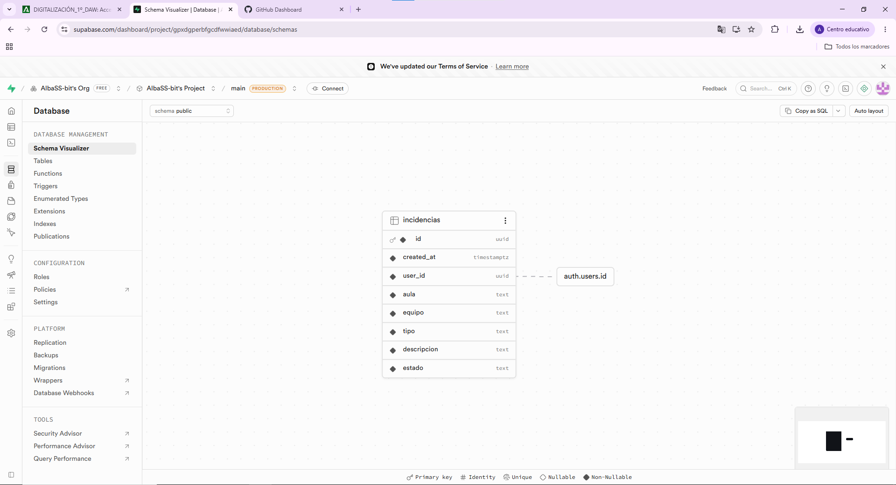
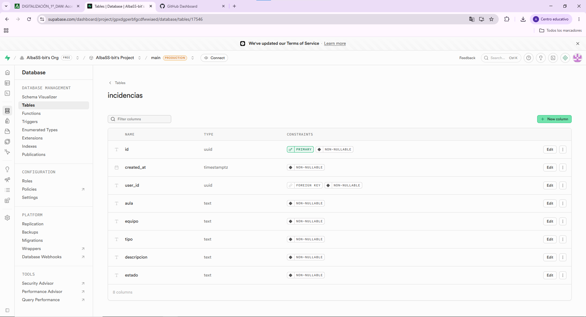
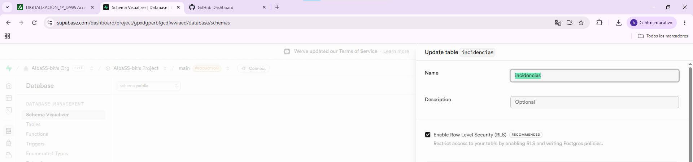
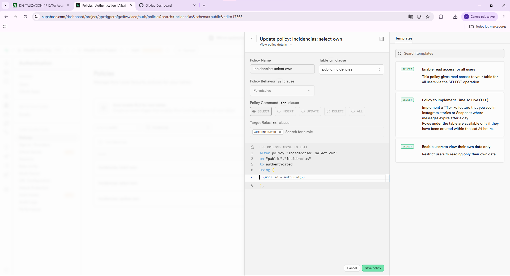
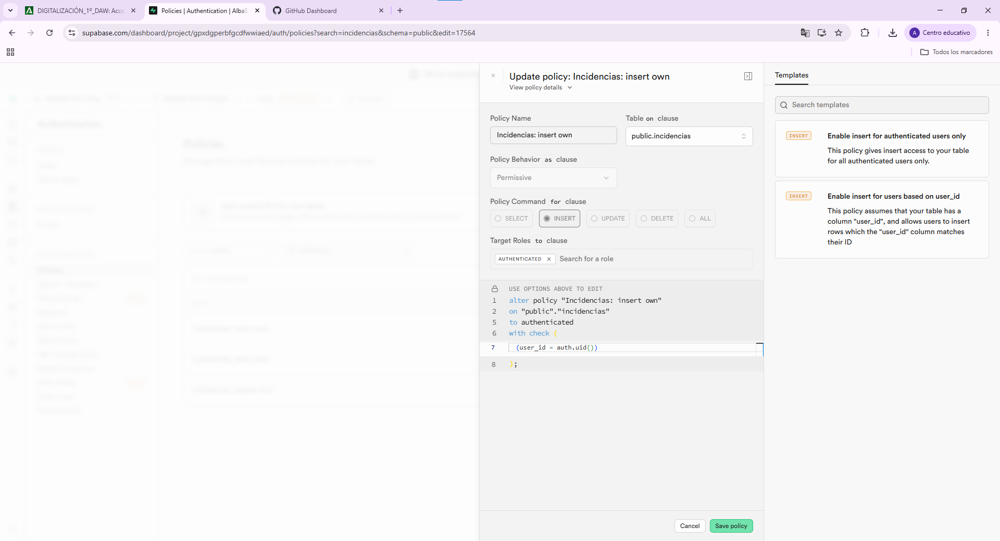

# Incidencias TIC (Cloud)

## Enlaces
- Repo: (pega aquí)
- GitHub Pages: (pega aquí)

## Evidencias (capturas)
<!-- Puedes añadir una imagen (captura de pantalla) del siguiente modo (sustituye "alt text" por un texto alternativo
para que tu documento gane accesibilidad. El ejemplo supone que las imágenes las guardas en la carpeta "res"):  -->

<!-- En Visual Studio Code puedes previsualizar un archivo markdown pulsando con botón derecho del ratón y seleccionando "Open preview"-->
1) Tabla `incidencias` (estructura):

2) RLS activado (se puede mirar en el editor de tablas de Supabase, pregunta a tu LLM favorito):

3) Policy (SELECT/INSERT/UPDATE) (se puede mirar donde mismo, pregunta a tu LLM favorito):

4) App funcionando (crear y listar):
5) App funcionando (cerrar incidencia):

## CE.f — Procedimiento de almacenaje cloud
- Servicio cloud usado: Supabase (Postgres + Auth + RLS)
- Estructura de tabla: La tabla consta de ocho columnas que se describen a continuación:
    · La primera columna que es la del campo id, de tipo uuid y la cual se refiere al identificador único de la incidencia ya que es la clave primaria de la tabla.

    · La segunda columna sería la del campo created_at, que es de tipo timestamp, no puede tener valores nulos y se refiere a la fecha y hora de creación de la tabla.

    · La tercera columna es la del campo user_id, de tipo uuid, y en este caso esta relacionada con el usuario que creó la incidencia, además de ser una clave foránea que relaciona la tabla incidencias con la tabla auth.users.

    · Una cuarta columna que pertenece al campo aula, de tipo texto, y la cual no puede tener un valor nulo. Se relaciona con el aula afectada por la incidencia.

    · La quinta columna sería la del campo equipo, de tipo texto, y no puede tener valores nulos. Esta columna se refiere al equipo al cual va dirigido la incidencia.

    · En la sexta columna tenemos el campo tipo, que sería del tipo texto, y cuyo valor está limitado a estos: 'Red','Impresora','Software','Hardware' u 'Otro'. Esta columna explica la categoría a la que pertenece la incidencia.

    · En la séptima columna encontramos el campo descripción que es de tipo texto, la cual no admite valores nulos y es donde se detalla el problema de la incidencia.

    · Por último, en la octava columna podemos ver el campo estado, de tipo texto, que por defecto tiene el valor 'abierta', pero que sólo admite los valores 'abierta' o 'cerrada'.

- Autenticación: La autenticación está registrada en Supabase mediante la siguiente línea de código: alter table public.incidencias enable row level security; De esta forma, sólo pueden acceder los usuarios que introduzcan las credenciales correctas.

- Permisos (RLS + policies): En cuanto a los permisos, hemos añadido politicas de insert, de select y de update, de forma que se apliquen a la tabla incidencias. Una vez hecho esto, tan solo el propietario del proyecto puede insertar, seleccionar o actualizar cualquier campo de la tabla.

- Conexión desde la app (URL + ANON KEY, supabase-js):

## CE.g — Importancia del cloud (beneficios)
- Productividad: Como estamos usando Supabase para realizar dicho proyecto, esto nos proporciona un backend instantáneo que no requiere la previa programación de la infraestructura, puesto que Supabase nos genera por sí mismo la base de datos, el sistema de autenticación y el almacenamiento de las APIs.

- Seguridad: Gracias al proceso de autenticación o a las propias politicas que sólo permiten realizar cambios al propietario, el riesgo de vulnerabilidad de datos se reduce de forma considerable.

- Coste: Al utilizar recursos remotos, disminuye la huella de datos, al mismo tiempo que el coste de adquisición, el de mantenimiento y el de actualización de los servidores y de los equipos.

- Escalabilidad y disponibilidad: Facilita o dificulta la obtención de recursos informáticos para una mayor adaptación frente a las demandas que van apareciendo sin tener que interrumpir el flujo de trabajo.

## RA5 — Riesgos y medidas
### Riesgos (3)
1)Vulnerabilidades de seguridad de datos.
2)Acceso a API no autenticadas.
3)Filtraciones de datos.

### Medidas (5)
1)Gestión de accesos e identidades (uso del servicio de identidad de google cloud).
2)Implementación de firewalls y redes privadas virtuales.
3)Uso de herramientas que permitan detectar anomalías como puede ser AWS CloudTrail o Cloud Security Command Center.
4)Protección de la información almacenada o enviada entre diferentes sistemas mediante un cifrado robusto.
5)Conservar diversas copias de seguridad automatizadas, que sean inmutables y que estén aisladas de cara a posibles ataques de ransomware. 